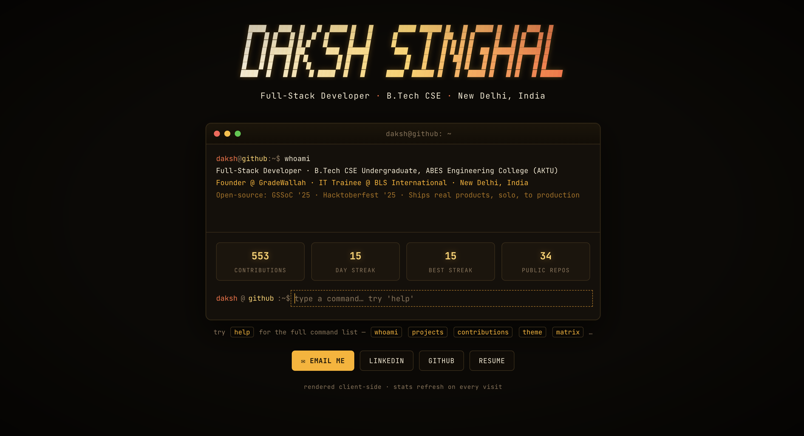

# 🌐 Daksh Singhal — Portfolio

My personal portfolio website — showcasing my projects, skills, and experience as a Full-Stack Developer. Built with plain HTML/CSS/JS and deployed via GitHub Pages.

🔗 **Live Site:** [daksh12345-del.github.io](https://daksh12345-del.github.io)

---

## ✨ Features

- 🖥️ **Interactive Terminal UI** — A retro terminal-style hero section with a real, typeable command line
- ⌨️ **Custom Commands** — Try `whoami`, `projects`, `contributions`, `theme`, `matrix` and more (run `help` for the full list)
- 📊 **Live GitHub Stats** — Contributions, current streak, best streak, and public repo count, refreshed on every visit (rendered client-side)
- 🚀 **Projects Showcase** — Highlights of featured work (GradeWallah, Sarvpratham Edu Consultants, Prime Builders, GreenPrint, and more)
- 🎨 **Glitch-Style Branding** — Distinctive animated name header
- 📄 **Resume Download** — Direct link to download my resume
- 🔗 **Quick Contact Buttons** — Email, LinkedIn, GitHub, and Resume, one click away
- 📱 **Fully Responsive** — Works smoothly across desktop, tablet, and mobile

## 🛠️ Tech Stack

   

## 📦 Installation

This is a static site — no build step or dependencies required.

```bash
# 1. Clone the repository
git clone https://github.com/Daksh12345-del/Daksh12345-del.github.io.git
cd Daksh12345-del.github.io

# 2. Open directly in your browser
open index.html
```

### Running with a local server (optional)

```bash
python3 -m http.server 5500
```

Then visit **http://localhost:5500**

## 📸 Screenshots

| Interactive Terminal Hero |
|---|
|  |

## 🚀 Live Demo

👉 [https://daksh12345-del.github.io](https://daksh12345-del.github.io)

## 🧑‍💻 Author

**Daksh Singhal**
[LinkedIn](https://www.linkedin.com/in/daksh-singhal-178b56282/) · [GitHub](https://github.com/Daksh12345-del)
